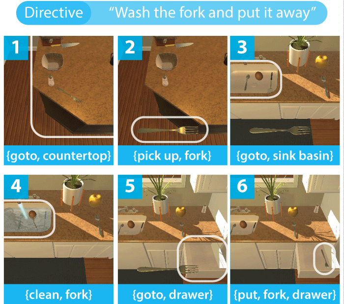

# Visually-Grounded Planning without Vision: Language Models Infer Detailed Plans from High-level Instructions

# Introduction
---
This is the repository for the paper [Visually-Grounded Planning without Vision: Language Models Infer Detailed Plans from High-level Instructions](http://cognitiveai.org/wp-content/uploads/2020/09/jansen2020-visual-planning-without-vision-alfred-gpt2-findingsemnlp.pdf) *(Findings of EMNLP 2020)*, which makes use of the Ask for ALFRED (https://askforalfred.com/) visually-grounded virtual agent task. 

For questions, comments, or issues, please e-mail pajansen@email.arizona.edu .

# Frequently Asked Questions / TL;DR
---
#### Q: I want to run my own transformer experiments on this dataset.  Where are the exact train/dev/test splits that were used in this paper?
They can be found in [/data/](https://github.com/cognitiveailab/alfred-gpt2/tree/master/data). Two versions are provided: *.gpt* the files are formatted for the GPT-2 transformer (with, e.g., the [SEP] tokens), while the companion *.txt* files are tab delimited to ease loading/scoring.

Pre-generated downsampled versions of the training data (for the experiment in Figure 2) can be found in [/data/downsampled/](https://github.com/cognitiveailab/alfred-gpt2/tree/master/data/downsampled), which also includes a script to make your own downsamples.

#### Q: Are there pregenerated predictions from this model, that I can plug into my system without having to run this one?
Yes:
* Human readable/tab delimited: [evalOut.test-full.output-full-epoch30.test-full.tsv](https://github.com/cognitiveailab/alfred-gpt2/blob/master/results/predictionsAndDataDependence/full/evalOut.test-full.output-full-epoch30.test-full.tsv)
* JSON format: [evalOut.test-full.output-full-epoch30.test-full.predicted.json](https://github.com/cognitiveailab/alfred-gpt2/blob/master/results/predictionsAndDataDependence/full/evalOut.test-full.output-full-epoch30.test-full.predicted.json)
* Only the errors: [evalOut.test-full.output-full-epoch30.test-full.errorsOut.tsv](https://github.com/cognitiveailab/alfred-gpt2/blob/master/results/predictionsAndDataDependence/full/evalOut.test-full.output-full-epoch30.test-full.errorsOut.tsv)

The above predictions are for the full model, trained at 30 epochs (from Figure 2).  Predictions for all the models in Figure 2 are available in [/results/predictionsAndDataDependence/](https://github.com/cognitiveailab/alfred-gpt2/tree/master/results/predictionsAndDataDependence)

#### Q: Is a pre-trained model available?

Yes. The pretrained model for the full training set at 30 epochs from Figure 2 is available here: [alfred-gpt2-full-epoch30-release.tar.gz](http://cognitiveai.org/dist/alfred-gpt2-full-epoch30-release.tar.gz) (1.4GB).  Due to their size the full set of other GPT-2 models aren't posted, but if you need them please [get in touch](mailto:pajansen@email.arizona.edu). 

The training code is straight from the [Huggingface Transformers library](https://github.com/huggingface/transformers/tree/master/examples/language-modeling), and the evaluation code builds upon the Huggingface library.  The Huggingface library changes frequently, so you're welcome to get in touch for the version cloned for this paper if you have any issues with a more modern version.

#### Q: Is the error analysis available?

Yes.  The error analysis used to generate Table 3 is available here: [/results/errorAnalysis/ALFRED-GPT2-MANUAL-ERROR-ANALYSIS.xlsx](https://github.com/cognitiveailab/alfred-gpt2/blob/master/results/errorAnalysis/ALFRED-GPT2-MANUAL-ERROR-ANALYSIS.xlsx).  There are 3 tabs, that include the raw data, summarized errors, histogram, and error labelling key. 

#### Q: Some of the ALFRED command sequences are quite long.  How does performance vary with sequence length?
While not included in the paper for space, the scorer also outputs performance by position in the command sequence.  That performance for the full model trained to 30 epochs is:

| Element Index | Full Tripple Accuracy | Sample Count (N) | Notes |
|:-------------:|:--------:|:-----:|:-----:|
|       1       |   0.414   |  7,571     |  Almost always {goto, startLocation}     |
|       2       |   0.896   |  7,571     |       |
|       3       |   0.839   |  7,571     |       |
|       4       |   0.802   |  7,538     |       |
|       5       |   0.597   |  5,582     |       |
|       6       |   0.688   |  5,558     |       |
|       7       |   0.606   |  3,152     |       |
|       8       |   0.725   |  2,325     |       |
|       9       |   0.557   |  1,073     |       |
|       10+     |   0.572   |  3,081     |       |

From the paper: The first triple in the command sequence is almost always {goto, startLocation}, and requires visual information much of the time. The Table 1, "Full Minus First" condition, excludes this to see how well the model performs on all other triples in the sequence.

#### Q: The evaluation/prediction script (run_evaluation1.py) seems to slow down over time.  Is that true?
Evaluating models on GPUs usually happens in "batches", or groups of (for example) 8 or 16 tasks that are sent to the GPU to be evaluated in parallel, for speed.  GPT-2 can behave in strange ways when the length of all the cue phrases (here, the natural language task descriptions) are not the same within each batch.  To handle this but still use batching for speed, the code pre-sorts the evaluation set into same-length task descriptions, and batches them out.  Because of this, some batches will be full, while others (with few tasks of the same length) may be less full, and be a little less efficient.  For a rough gauge, it takes about 15 minutes on the Titan RTX machine to run a full set of predictions/scoring on the test set. 

#### Q: Why does the main analysis use 25 epochs, and the data dependence analysis use {10, 20, 30} epochs?
The main analysis tuned performance on the development set, which found that performance tends to asymptote at approximately 25 epochs.  The data dependency analysis was done directly on the test set on preselected values (10, 20, or 30 epochs) to plot the graph, but wasn't rendered at finer detail due to training time requirements.  There is a slight performance difference (about 1%) between performance at 25 and 30 epochs. 

#### Q: 15% of errors included a disagreement on where to discard used *cutlery*?
Yes, this remarkable, unusual, and hilarious source of error is real.  To quote the paper: 

*"An unexpected source of error is that our GPT-2 planner frequently prefers to store used cutlery in either the fridge or microwave -- creating a moderate fire hazard.  Interestingly, this behavior appears learned from the training data, which frequently stores cutlery in unusual locations.  Disagreements on discarded cutlery locations occurred in 15% of all errors."*

Here are some of these errors from the error analysis:
| Error Analysis Notes |
| ------------- |
| Gold puts knife in gabage, predicted puts knife in **fridge** |
| Instructions say potato, gold says apple. Predicted places knife in **microwave** instead of countertop |
| Misses moving to the lettuce before cutting it, places knife in **fridge** instead of countertop |
| Places knife in **cabinet** (gold places it in **garbage**). Surrounding go to movements to get to garbage can missing |
| Places knife in **fridge** (gold places it in **garbage**). Surrounding go to movements to get to garbage can missing |
| Places knife in **fridge** instead of countertop |
| Places knife in **fridge** instead of countertop |
| Places knife in **microwave** (gold places it in **fridge**) |
| Places knife in **microwave** (gold places it on countertop) |
| Places used knife in **countertop** (gold path places it in **microwave**). Forgets the potato is on the countertop and instead ties to retrieve it from the fridge. |
| Places used knife in **microwave** (gold is side table) |
| Puts knife in **fridge** instead of resting it on the counter (should still work, though) |
| Puts knife in **microwave** instead of resting it on countertop |
| Puts the knife in the **garbage** instead of on the counter |
| Throws out the knife in the **garbage** instead of resting it on the counter after use |

# Requirements
---
Software:
  * The experiments were run in a Python conda environment (python 3.7) that can be replicated using the requirements.txt file: pip3 install -r requirements.txt

Hardware:
  * The GPT-2 models were trained on a Titan RTX with 24GB of RAM.  For evaluation, much less GPU RAM is required if you decrease the evaluation batch size.  It generally takes between 1-6 hours to train a model, depending on the hyperparameters.

